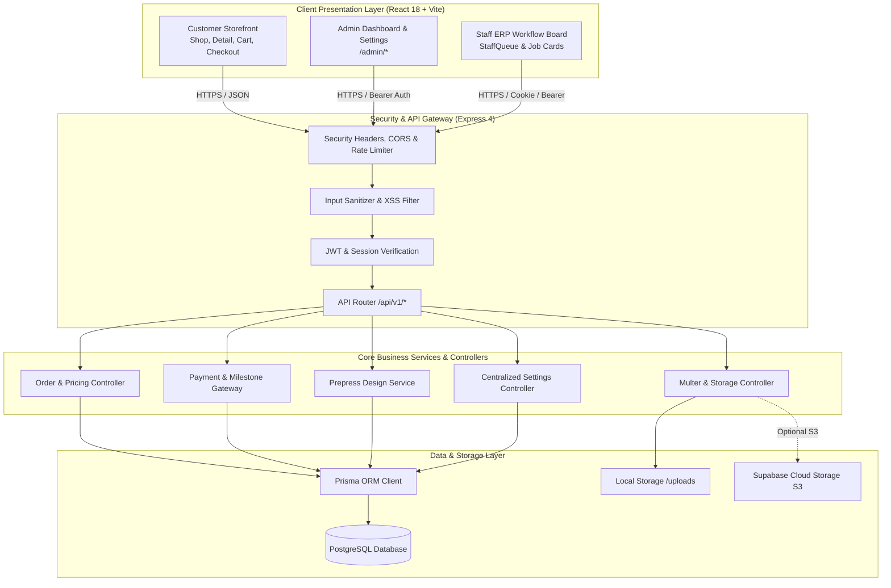
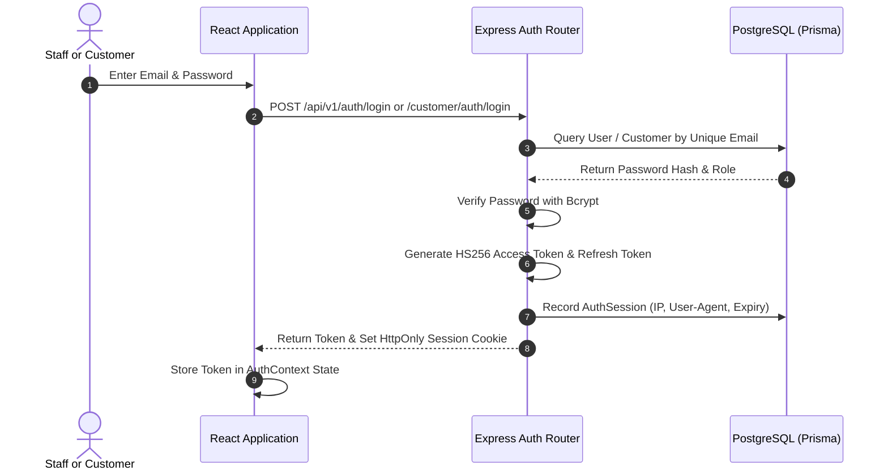
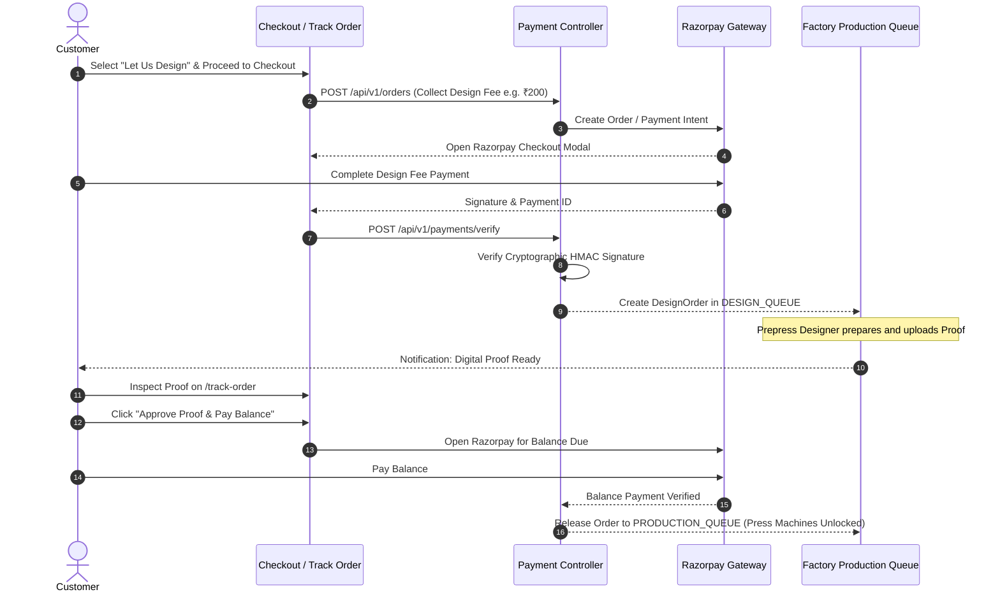
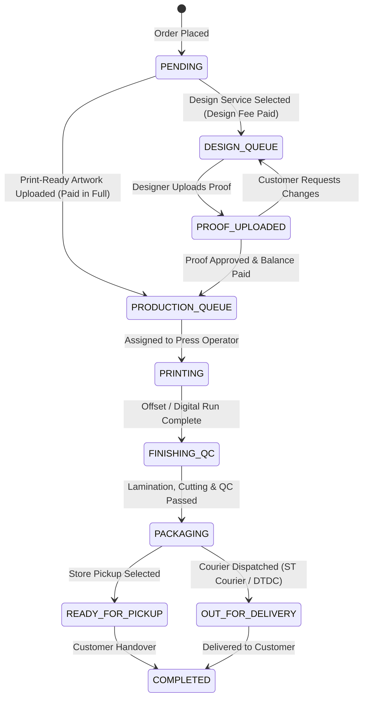

# Print Bazzar — System Architecture & Data Flow Guide

---

## 1. High-Level Architecture Overview

Print Bazzar is designed with an API-first, decoupled multi-tier architecture separating the client presentation layer from the core transactional backend and ERP state machines.

---

## 2. Core Operational Workflows

### A. Authentication & Session Flow
The platform supports dual authentication paths for internal staff and public customers:

* **Staff Authentication**: Validated against `User`, `Role`, and `RolePermission` tables. Enforces department authorization.
* **Customer Authentication**: Validated against `Customer` table with corporate B2B flags.

---

### B. Two-Stage Order & Milestone Payment Flow
Commercial printing often requires custom artwork preparation before press setup. Print Bazzar implements a safe two-stage milestone payment model:

---

### C. File Preflight & Upload Flow
To prevent blurry or misaligned prints:
1. **Client-Side Preflight Analyzer** (`utils/preflightAnalyzer.js`):
   - Reads image dimensions, DPI, orientation, and aspect ratio in the browser.
   - Calculates bleed box margin (+3mm) and warns if file resolution is under 300 DPI.
2. **Secure Binary Ingestion** (`middleware/fileUpload.js`):
   - Validates MIME type (`image/jpeg`, `image/png`, `image/webp`, `application/pdf`, `application/zip`, `application/postscript`).
   - Limits payload size (up to 50MB).
   - Generates randomized cryptographic filenames.
3. **Storage Strategy**:
   - Saves to local disk at `server/uploads/` with secure HTTP disposition headers.
   - Optionally mirrors to cloud storage buckets (Supabase Storage / AWS S3) if credentials are provided in `.env`.

---

### D. ERP Factory Fulfillment State Machine

---

## 3. Security & Resilience Architecture

* **Stateless Token Verification**: Tokens signed with HS256 using server-side secret; zero DB query needed for read-only route authentication.
* **Database Connection Resilience**: Graceful transaction handling with automatic retry on transient connection drops.
* **Input Sanitization**: Strip dangerous HTML tags, inline scripts, and SQL injection payloads on all JSON requests.
* **Centralized Website Settings**: Key business attributes stored in `StoreSetting` JSON records, cached in server memory with cache-invalidation hooks on every update.
