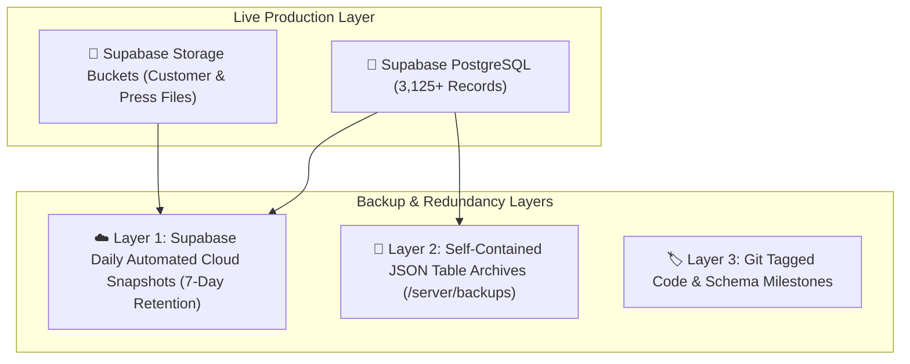

# Print Bazzar — Backup & Disaster Recovery Runbook
**Objective**: Zero data loss, immediate rollback capability, automated point-in-time recovery.  

---

## 1. Backup Architecture & Layers

Print Bazzar implements a multi-tiered backup strategy:



---

## 2. Backup Execution Procedures

### A. Creating an Immediate On-Demand Snapshot
Run the automated database exporter prior to any schema modification, mass catalog update, or deployment:

```bash
cd server
node src/scripts/exportFullDatabaseBackup.js
```

**Output**:
- Creates `server/backups/printbazzar_full_backup_[TIMESTAMP].json` containing complete relational records across all 33 tables.
- Updates `server/backups/printbazzar_latest_backup.json` as the default rollback baseline.

---

## 3. Disaster Recovery & Restoration Procedures

### A. Automated Point-in-Time Rollback
If an accidental deletion, bad script, or corrupted catalog occurs, restore the database state with a single command:

```bash
cd server
# Restore from latest verified baseline:
node src/scripts/restoreDatabaseFromBackup.js

# Or restore from a specific timestamped archive:
node src/scripts/restoreDatabaseFromBackup.js backups/printbazzar_full_backup_2026-09-03T08-33-29-504Z.json
```

**Restoration Flow**:
1. Connects to PostgreSQL via direct connection.
2. Reads the verified JSON tables archive.
3. Restores records in strict foreign-key dependency order (`Role` ➔ `User` ➔ `Category` ➔ `Product` ➔ `Option` ➔ `PriceSlab` ➔ `Order` ➔ `OrderItem` ➔ `DesignOrder` ➔ `Revision`).
4. Uses `upsert` matching primary keys, ensuring existing untainted data is updated and missing records are resurrected without collision.

---

## 4. Disaster Scenarios & Recovery Runbook

| Disaster Scenario | Impact | Recovery Procedure |
| :--- | :--- | :--- |
| **Accidental Product Deletion** | Product missing from storefront | Execute `restoreDatabaseFromBackup.js`. Product and options will be resurrected instantly. |
| **Corrupted Order or Pricing Slabs** | Calculation mismatch | Restore `ProductPriceSlab` and `ProductOptionValue` records from the latest backup. Historical order snapshots ensure active customer invoices remain untouched. |
| **Bad Prisma Migration** | Database schema out of sync | 1. Rollback schema file to previous Git commit.<br>2. Run `npx prisma db push`.<br>3. Run `restoreDatabaseFromBackup.js`. |
| **Complete Cloud Project Loss** | Total database outage | 1. Provision new Supabase project.<br>2. Update `DATABASE_URL` in `.env`.<br>3. Run `npx prisma db push`.<br>4. Run `restoreDatabaseFromBackup.js`. Full system restored in < 5 minutes. |
