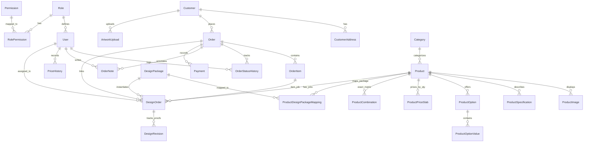

# Print Bazzar — Database Schema & Data Dictionary
**Database Provider**: Supabase PostgreSQL 15  
**ORM**: Prisma 5.22.0  
**Datasource**: Connection Pooling via PgBouncer (`6543`) with Direct Fallback (`5432`)  

---

## 1. Entity Relationship (ER) Summary

---

## 2. Core Models Specification

### A. Authentication & Access Control
- **`User`**: Internal staff and administrative accounts (`id`, `name`, `email`, `passwordHash`, `department`, `roleId`, `isActive`, `lastLoginAt`, timestamps).
- **`Role`**: Role master table (`SUPER_ADMIN`, `ADMIN`, `DESIGNER`, `PRESS_OPERATOR`, `QC_EXECUTIVE`, `PACKING_DESK`, `DELIVERY_BOY`).
- **`Permission`**: Granular feature flags (`PRODUCT_CREATE`, `PRODUCT_EDIT`, `ORDER_VIEW`, `ORDER_UPDATE`, `WORKFLOW_VIEW`, `SETTINGS_EDIT`, etc.).
- **`RolePermission`**: Join table mapping roles to permissions with composite primary key `@@unique([roleId, permissionId])`.

### B. Customers & Corporate Accounts
- **`Customer`**: B2C retail and B2B corporate customer records (`id`, `name`, `mobile`, `email`, `companyName`, `gstNumber`, `customerType`, `isActive`).
- **`CustomerAddress`**: Delivery and billing addresses (`id`, `customerId`, `addressLine`, `city`, `state`, `pincode`, `landmark`, `isDefault`, `addressType`).

### C. Catalog & Dynamic Product System
- **`Category`**: Root navigation and taxonomy (`id`, `name`, `slug`, `description`, `iconUrl`, `bannerUrl`, `displayOrder`, `isActive`).
- **`Product`**: Master printing product definition:
  - Identification: `id`, `categoryId`, `name`, `slug`, `sku`
  - Pricing defaults: `startingPrice`, `customUnitPrice`, `minQuantity`, `maxQuantity`, `quantityUnit`
  - Prepress charges: `singleSideDesignCharge`, `doubleSideDesignCharge`, `hasCustomDesign`
  - Dimensions: `widthMm`, `heightMm`, `bleedMm`
  - Flags: `isActive`, `isFeatured`, `isBestSeller`
- **`ProductImage`**: Product gallery (`id`, `productId`, `imageUrl`, `imageType`, `displayOrder`).
- **`ProductSpecification`**: Technical details (`id`, `productId`, `specKey`, `specValue`, `displayOrder`).
- **`ProductOption`**: Selectable customer inputs (`id`, `productId`, `optionName`, `optionType`, `isAddon`, `isRequired`, `displayOrder`).
- **`ProductOptionValue`**: Options values with modifier values (`id`, `optionId`, `valueLabel`, `priceModifierType`, `priceModifierValue`, `displayOrder`).
- **`ProductPriceSlab`**: Volume price tiers (`id`, `productId`, `minQty`, `maxQty`, `unitPrice`, `singleSidePrice`, `doubleSidePrice`).
- **`ProductCombination`**: Exact matrix price for multi-dimensional configurations (`id`, `productId`, `combinationKey`, `optionsJson`, `quantity`, `price`, `isAvailable`).

### D. Design Service System
- **`DesignPackage`**: Centralized master packages (`id`, `name`, `badge`, `shortDescription`, `detailedDescription`, `basePrice`, `doubleSidePrice`, `concepts`, `revisions`, `deliveryDays`, `deliveryTimeText`, `expressDeliveryCharge`, `featuresJson`, `sortOrder`, `isActive`, `isDefault`).
- **`DesignAddon`**: Reusable selectable extras (`id`, `name`, `price`, `description`, `badge`, `sortOrder`, `isActive`).
- **`ProductDesignPackageMapping`**: Join model with product overrides (`id`, `productId`, `packageId`, `customPrice`, `customDoubleSidePrice`, `sortOrder`, `isDefault`, `isActive`).
- **`DesignOrder`**: Production ticket for graphic design:
  - Job tracking: `designJobNumber` (e.g. `PB-DES-2026-00001`), `orderId`, `orderItemId`, `productId`, `packageId`
  - Snapshots: `packageNameSnapshot`, `packagePriceSnapshot`, `packageSnapshotJson`, `addonsSnapshotJson`
  - Requirements: `requirementNotes`, `preferredStyle`, `preferredColor`, `briefResponsesJson`, `uploadedAssetsJson`
  - Production state: `status`, `priority`, `designerId`, `deadline`, `approvedAt`, `finalFilesJson`
- **`DesignRevision`**: Revision rounds (`id`, `designOrderId`, `revisionNumber`, `draftFileUrl`, `designerResponse`, `customerComment`, `status`).

### E. Orders & Production ERP
- **`Order`**: Master business purchase order:
  - Customer info: `orderNumber`, `customerId`, `customerName`, `customerEmail`, `customerMobile`, `gstNumber`
  - Financials: `subtotal`, `discountAmount`, `shippingCharge`, `cgstAmount`, `sgstAmount`, `totalTax`, `grandTotal`
  - Workflow: `orderStatus`, `paymentStatus`, `currentDepartment`, `assignedStaffName`, `proofStatus`, `proofFileUrl`, `proofApprovedAt`
  - Logistics: `deliveryType`, `trackingReference`, `courierPartner`
- **`OrderItem`**: Immutable line items with snapshots:
  - Product references: `productId`, `productNameSnapshot`, `skuSnapshot`
  - Prices: `quantity`, `unitPriceSnapshot`, `totalPriceSnapshot`, `designCharge`
  - Snapshots: `specificationsSnapshot`, `optionsSnapshot`, `selectedAddons`, `preferredStyle`, `preferredColor`, `requirementNotes`
- **`OrderStatusHistory`**: Chronological department movement audit log (`id`, `orderId`, `previousStatus`, `newStatus`, `note`, `changedById`).
- **`Payment`**: Transaction records (`id`, `orderId`, `amount`, `paymentMethod`, `status`, `transactionRef`, `gatewayResponseJson`).
- **`AuditLog`**: Administrative changes tracking (`id`, `userId`, `action`, `entityType`, `entityId`, `oldDataJson`, `newDataJson`, `ipAddress`).
