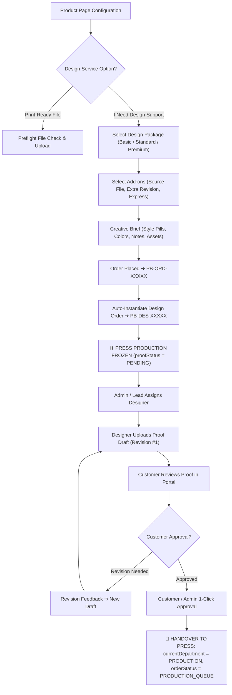

# Print Bazzar — Centralized Design Services & Job Management
**Module**: Centralized Design Package Management & Integrated Product Design Option  

---

## 1. System Architecture & Workflow Pipeline

Design services are integrated as an optional add-on inside applicable printing products (not a disconnected standalone site):

---

## 2. Admin Dashboard Control Center (`/admin/design-services`)

The Admin dashboard features a 5-tab executive interface:

1. **Tab A: Design Packages**:
   - Master catalog of reusable packages (Basic ₹299/₹499, Standard ₹499/₹799, Premium ₹999/₹1,499).
   - CRUD modal with features checklist builder, concept count, revision limits, and turnaround days.
   - 1-click duplicate, activate/deactivate toggle, and safe soft-archive rule.
2. **Tab B: Design Add-ons**:
   - Master catalog of optional extras:
     - Extra Revision (+₹150)
     - Editable Vector Source File (+₹300)
     - Extra Design Concept (+₹300)
     - Express 24-Hour Turnaround (+₹500)
     - Content & Copywriting (+₹300)
     - Image Retouching & Clipping (+₹100)
3. **Tab C: Product Design Mapping**:
   - Product selector dropdown to inspect/configure design packages for any product.
   - Master "Enable Design Service? YES / NO" toggle.
   - Package selection checkboxes with custom price override inputs per product.
   - Default package radio button.
   - Bulk Assign modal to map packages across multiple products at once.
4. **Tab D: Design Orders (Design Jobs Hub)**:
   - Queue of active design jobs with status filtering and search.
   - Drawer modal displaying customer creative brief, style preferences, and asset download links.
   - Staff designer assignment dropdown.
   - Proof draft upload with revision tracking.
   - 1-click "Approve Design (Activate Press)" button.
5. **Tab E: Design Settings**:
   - Configurable max file size (MB), allowed formats (`PDF,AI,CDR,PSD,PNG,JPG,SVG`), and sequential Job ID prefix (`PB-DES`).

---

## 3. Historical Price Protection Guarantee

When an administrator edits a design package's price in the master catalog:
- All new customer orders use the updated price.
- **Past orders retain their original immutable price snapshot** (`packagePriceSnapshot` and `addonsSnapshotJson` on `DesignOrder`).
- Historical invoices, accounting ledgers, and customer order histories never change.
