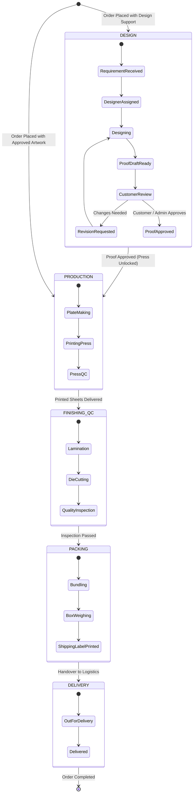

# Print Bazzar — In-House Prepress & Production ERP Workflow
**Module**: Industrial Printing Kanban & Department Handover Engine (`/admin/workflow`)  

---

## 1. Multi-Department Kanban Workflow Pipeline

Every order moves through a strict 6-stage physical manufacturing pipeline:

---

## 2. Department Gates & Production Freeze Rules

1. **Prepress Gate (Proof Freeze)**:
   - Orders with `artworkOption === 'DESIGN_SUPPORT'` cannot be moved into `PRODUCTION` until `proofStatus === 'APPROVED'`.
   - The production press operator interface flags unapproved jobs with a red warning badge `⏸️ HELD IN DESIGN PROOFING`.
2. **Sequential Handover Audit Trail**:
   - Every column drag-and-drop or status update creates a timestamped record in `OrderStatusHistory` recording:
     - `previousStatus`
     - `newStatus`
     - `changedById` (Staff User ID)
     - `note` (e.g. "Lamination completed on Komori Press #2")
3. **SMS & WhatsApp Notifications**:
   - When proof draft is uploaded ➔ WhatsApp alert sent to customer with proof preview link.
   - When order is dispatched ➔ SMS alert sent with tracking reference.
