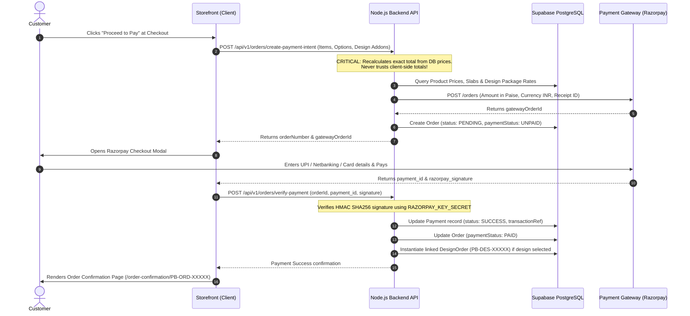

# Print Bazzar — Payment Integration & Financial Security
**Standard**: 100% Server-Side Amount Recalculation & Cryptographic Signature Verification  

---

## 1. End-to-End Payment Flow Diagram

---

## 2. Mandatory Financial Security Rules

1. **Zero Trust on Frontend Totals**:
   Any price or subtotal sent in the HTTP request payload is treated solely as an unverified UI hint. The server retrieves active base rates, slab prices, finishing surcharges, design package fees, add-ons, and GST percentages directly from the database and calculates the canonical charge.
2. **Cryptographic Webhook & Signature Verification**:
   Payment callbacks must verify the SHA256 HMAC signature against `RAZORPAY_KEY_SECRET`. Orders are never marked `PAID` without mathematical cryptographic proof from the gateway.
3. **Double-Spend Prevention**:
   Every payment verification checks if the order has already been marked `PAID`. Subsequent callback attempts are treated as idempotent updates without duplicating design tickets or stock deductions.
