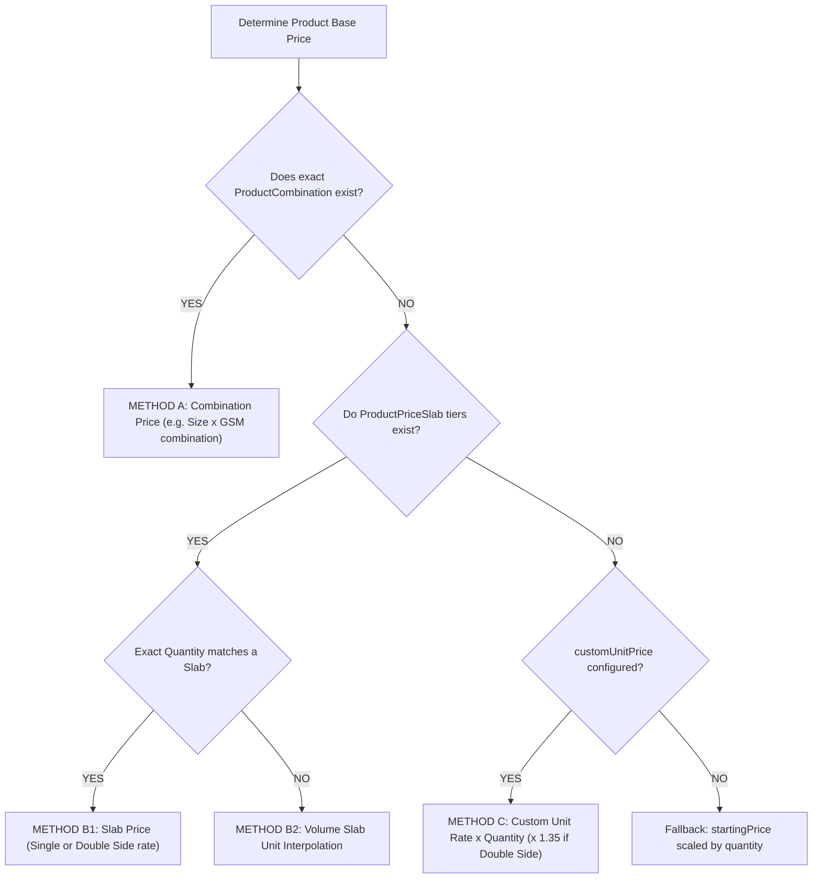

# Print Bazzar — Dynamic Pricing Engine Specification
**Engine Locations**: `server/src/utils/pricingEngine.js` (Server) & `client/src/utils/pricingEngine.js` (Client)  
**Standard**: Mathematical Client-Server Parity with Zero Hardcoded Business Prices  

---

## 1. Unified Mathematical Pricing Formula

$$\text{Subtotal} = \text{Product Base Price} + \text{Finishing Surcharges} + \text{Base Design Package Fee} + \text{Design Add-ons Fee}$$

$$\text{GST Amount} = \text{Subtotal} \times 18\% \quad (\text{CGST } 9\% + \text{SGST } 9\%)$$

$$\text{Grand Total} = \text{Subtotal} + \text{GST Amount} + \text{Shipping Fee}$$

---

## 2. Product Base Price Resolution Priority

The pricing engine resolves the product base price using a 3-tier cascade:

---

## 3. Finishing & Option Surcharges

Options configured as add-on modifiers (`isAddon: true`) add flat or unit fees:
- **`FLAT`**: Flat surcharge added to the order line (e.g. Spot UV setup fee ₹250).
- **`PER_UNIT`**: Scaled by ordered quantity (e.g. Metallic Foil ₹0.50 per card).
- **`PERCENT`**: Percentage increase over the base printing subtotal (e.g. Velvet Lamination +15%).

---

## 4. Design Service Charge Resolution

When `artworkOption === 'DESIGN_SUPPORT'`:
1. **Base Package Fee**:
   - Resolved from mapped `DesignPackage` or product-specific custom override in `ProductDesignPackageMapping`.
   - If double-sided printing is selected, uses `doubleSidePrice` (or `customDoubleSidePrice`).
   - If single-sided, uses `basePrice` (or `customPrice`).
2. **Selected Add-ons**:
   - Sums the prices of all checked add-ons from `selectedAddons` (Extra Revision ₹150, Editable Vector File ₹300, Express Delivery ₹500, etc.).
3. **Total Design Service Fee**:
   $$\text{totalDesignServiceFee} = \text{basePackageFee} + \sum \text{addon.price}$$
